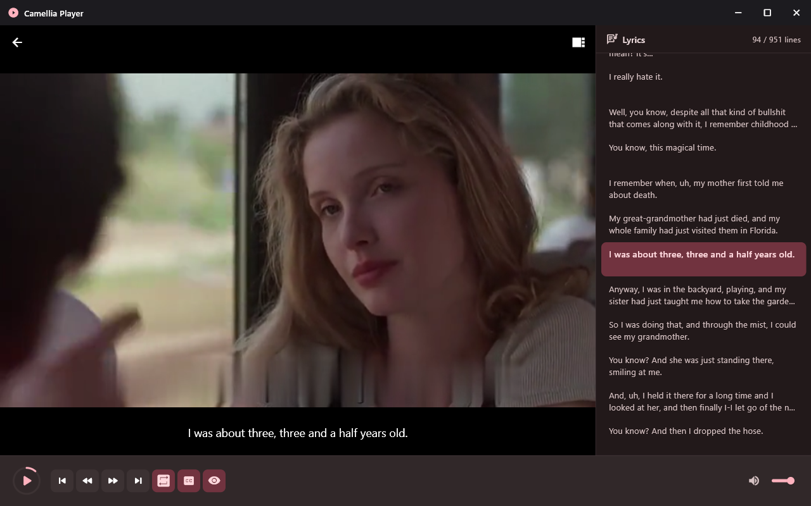

# Camellia Player



Camellia Player is a Flutter-based local audio and video player that allows English learners to **repeat lyrics line by line**. The supported targets are **Windows desktop**, **macOS desktop**, and **iOS**.

## Features

- Play local audio and video files
- Load matching subtitle files from the media file's folder
- Open SRT, WebVTT, ASS, or SSA subtitles manually
- Remember the last played file
- Browse files with an iOS-native interface
- Pick files or drag them onto the Windows window
- Show a subtitle/lyrics list and jump between cues
- Record a short voice clip from the Windows player controls

Codec availability depends on the operating system and the media libraries it provides. MP4 with H.264 video and AAC audio is the safest format for both platforms. Windows uses `media_kit`; iOS uses AVFoundation through Flutter's `video_player` package.

## Supported platforms

| Platform | Player and interface |
| --- | --- |
| Windows 10/11 (x64) | Material interface, custom window controls, file picker, and drag and drop |
| macOS 11 or later (universal/x64/arm64) | Material interface, custom window controls, file picker, and drag and drop |
| iOS 15 or later | Cupertino interface, Files picker, and app Documents browser |

Android, Linux, and Web are not supported.

## Requirements

### Windows

- Flutter SDK compatible with Dart 3.11 or later
- Visual Studio 2022 with the **Desktop development with C++** workload

### macOS

- macOS 11 (Big Sur) or later
- Xcode with the command-line tools (`xcode-select --install`)
- Flutter SDK compatible with Dart 3.11 or later
- CocoaPods

### iOS

- macOS with Xcode
- Flutter SDK compatible with Dart 3.11 or later
- CocoaPods
- An Apple development team when running on a physical device or making a signed release build

Check the local toolchains before building:

```console
flutter doctor -v
flutter pub get
```

## Run the app

Windows:

```console
flutter run -d windows
```

macOS (must be built on a Mac):

```console
flutter run -d macos
```

iOS Simulator (replace the device name with one installed locally):

```console
flutter devices
flutter run -d "iPhone 16 Pro"
```

To run on a physical iPhone, open `ios/Runner.xcworkspace` in Xcode, select the Runner target, set a signing team and unique bundle identifier, then select the device in Flutter or Xcode.

## Release builds

Windows:

```console
flutter build windows --release
```

The distributable files are written to `build/windows/x64/runner/Release/`. Ship the entire folder, not only the `.exe`, because the application also needs its DLLs and data directory.

macOS (must be built on a Mac):

```console
flutter build macos --release
```

The `.app` bundle is written to `build/macos/Build/Products/Release/`. To distribute, ship the entire `Camellia Player.app` (drag it into `/Applications`, or zip and notarize it for wider distribution).

> **Note:** After running `flutter create --platforms=macos .` for the first time, open `macos/Runner/Configs/AppInfo.xcconfig` and set `PRODUCT_NAME = Camellia Player` so the output path matches what `build-macos.yml` expects (`build/macos/Build/Products/Release/Camellia Player.app`).

iOS Simulator build (no signing required):

```console
flutter build ios --simulator --no-codesign
```

Signed iOS build:

```console
flutter build ios --release
```

For App Store distribution, open `ios/Runner.xcworkspace` and use **Product > Archive** in Xcode.

## Subtitles

When opening a media file, Camellia Player looks in the same folder for a subtitle with the same base name. For example:

```text
lesson.mp4
lesson.srt
```

Recognized companion extensions are `.srt`, `.vtt`, `.ass`, and `.ssa`. In the iOS Documents browser, same-name lyrics are detected automatically. When importing from the iOS Files picker, select the media file and its same-name lyric file together because iOS may expose each selected document through a temporary location. You can also use the subtitle button in the player to choose lyrics later.

## Keyboard shortcuts (Windows)

| Key | Action |
| --- | --- |
| Space | Play or pause |
| Left / Right | Previous / next subtitle cue |
| Home / End | First / last subtitle cue |
| Up / Down | Volume up / down |
| L | Show or hide the lyrics list |
| R | Repeat the current lyric |
| S | Toggle the embedded subtitle track, and the centered lyric overlay that appears on top of the audio artwork when playing `.wav`, `.mp3`, or `.aac` files |

## Centered lyric overlay for audio files

When a `.wav`, `.mp3`, or `.aac` file is playing and a sibling subtitle
(`.srt`, `.vtt`, `.ass`, or `.ssa`) is loaded, the current lyric cue is
shown centered on top of the audio artwork. The overlay is controlled by
the **Subtitle on / off** button (or the **S** keyboard shortcut) and
mirrors the behavior of the in-video subtitle track on Windows. Use the
**Show lyric** button (or **L**) to toggle the side lyrics panel
independently.

## Project structure

```text
lib/
  main.dart                Platform selection and app entry point
  home_screen.dart         Windows home screen
  player_screen.dart       Windows media player
  ios_home_screen.dart     iOS file browser and home screen
  ios_player_screen.dart   iOS media player
  playback_manager.dart    Windows playback state
  subtitle_loader.dart     SRT, VTT, ASS, and SSA parsing
  last_played.dart         Last-played persistence
windows/                   Windows runner
macos/                     macOS runner and Xcode project
ios/                       iOS runner and Xcode project
```

## Troubleshooting

If Windows reports that Visual Studio is missing, install the **Desktop development with C++** workload and run `flutter doctor -v` again.

### macOS microphone / voice recording

If the in-app voice recorder (the `V` shortcut in the bottom mini-player)
fails on macOS, the app needs microphone permission. Add the following
key to `macos/Runner/Info.plist`:

```xml
<key>NSMicrophoneUsageDescription</key>
<string>Camellia Player needs the microphone to record short voice clips from the player controls.</string>
```

And enable the **Audio Input** capability in the Runner target's
Signing & Capabilities in Xcode. If you ship a sandboxed build, also
add `com.apple.security.device.microphone` to the entitlements file.

### CocoaPods on macOS or iOS

```console
sudo gem install cocoapods
flutter pub get
cd macos
pod install
cd ..
```

Always open `macos/Runner.xcworkspace`, not `Runner.xcodeproj`, after CocoaPods has been installed.

> **Tip:** CocoaPods 1.16+ double-injects the `POD_CONFIGURATION_*` macros
> into the compiler command line, which produces a wall of
> "macro redefined" warnings on every `pod install`. To silence them, add
> the following block to the `post_install` hook in **both** `ios/Podfile`
> and `macos/Podfile` (replace any existing `post_install do |installer|`
> block):
>
> ```ruby
> post_install do |installer|
>   installer.pods_project.targets.each do |target|
>     flutter_additional_ios_build_settings(target)
>     target.build_configurations.each do |config|
>       defs = config.build_settings['GCC_PREPROCESSOR_DEFINITIONS'] || ['$(inherited)']
>       defs = [defs] unless defs.is_a?(Array)
>       defs.reject! { |d| d.to_s.start_with?('POD_CONFIGURATION_') }
>       config.build_settings['GCC_PREPROCESSOR_DEFINITIONS'] = defs
>     end
>   end
> end
> ```
>
> (`ios/Podfile` already contains this block.)

If iOS reports that CocoaPods is missing or the pods are stale:

```console
flutter pub get
cd ios
pod install
cd ..
```

Always open `ios/Runner.xcworkspace`, not `Runner.xcodeproj`, after CocoaPods has been installed.

## Quality checks

```console
flutter analyze
flutter test
```
