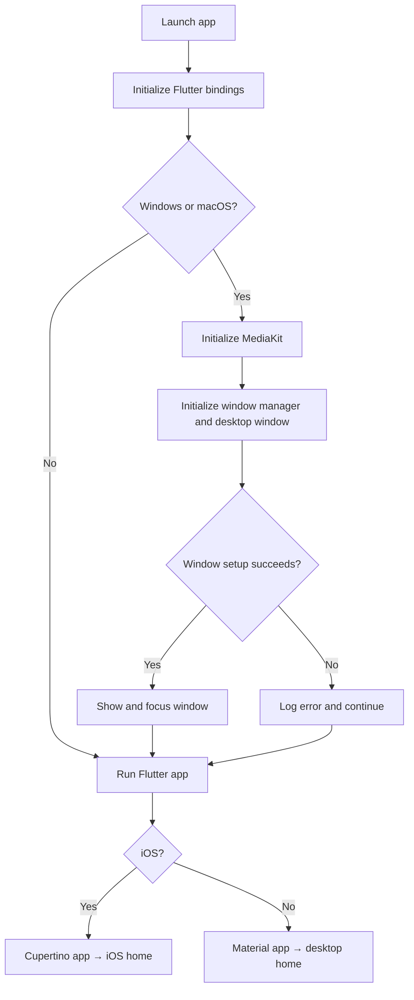
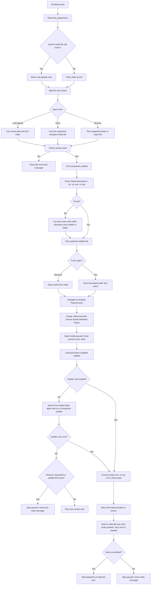
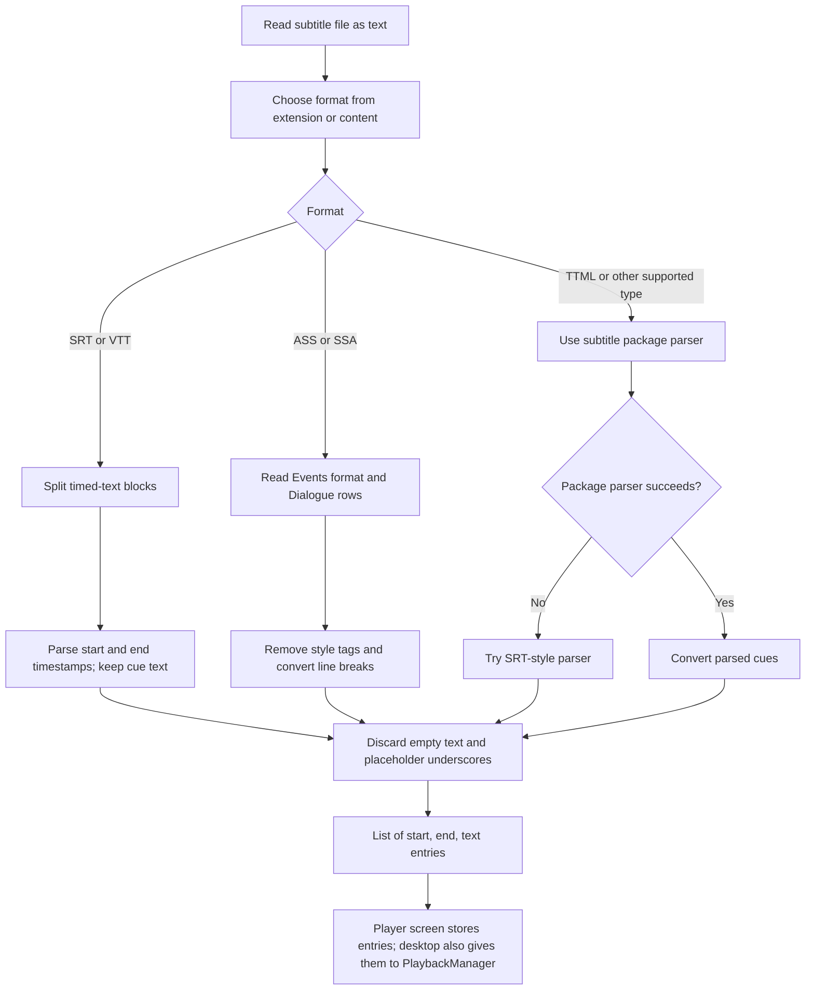
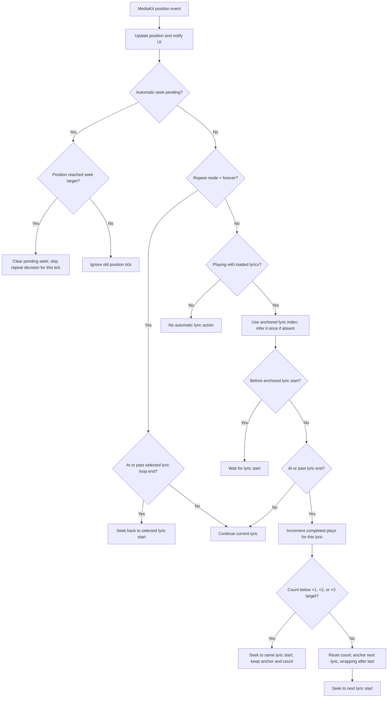
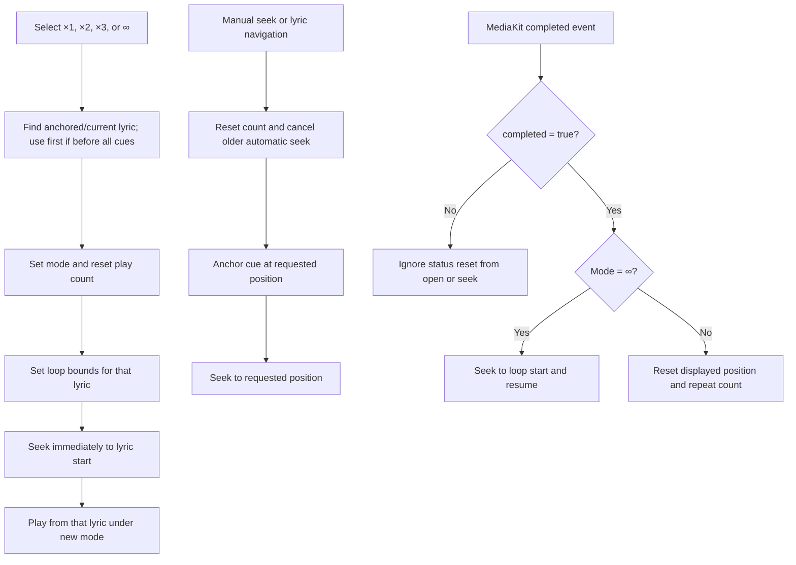
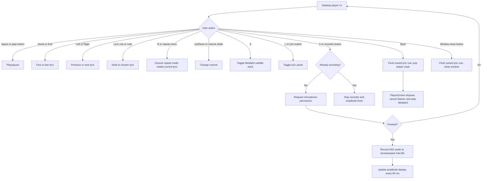
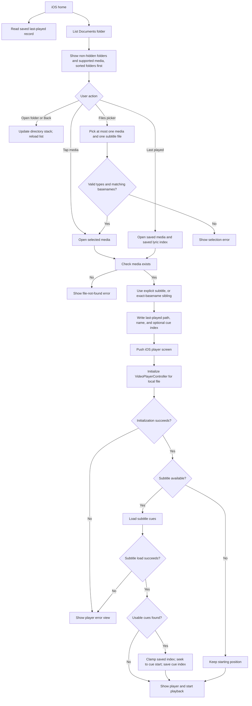
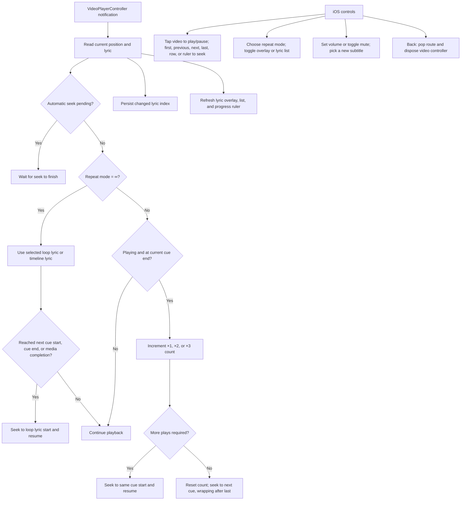
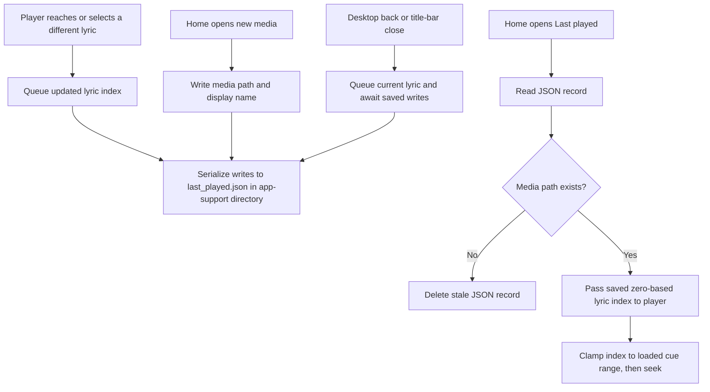

# Camellia Player — application logic

This document maps the current code in `lib/` and the Windows runner. Windows and macOS use the desktop path; iOS uses a separate player. The diagrams show implemented behavior, including error and fallback paths. Visual layout and color constants are omitted because they do not change the control flow.

## 1. App startup and platform choice

On Windows, the native runner creates the Flutter window, registers plugins, shows the first frame, and processes Windows messages. Flutter then applies the custom window title bar and the dark theme. Source: `windows/runner/main.cpp`, `windows/runner/flutter_window.cpp`, `lib/main.dart`.

## 2. Desktop: choose a file and begin playback

The desktop picker accepts MP3, AAC, WAV, MP4, M4V, MKV, WebM, MOV, AVI, and WMV. The drop target ignores unsupported files. Source: `lib/home_screen.dart`, `lib/player_screen.dart`, `lib/playback_manager.dart`.

## 3. Shared subtitle loading

SRT and VTT fractions are normalized to milliseconds. Cue text is active from its start until just before its end. Source: `lib/subtitle_loader.dart`.

## 4. Desktop: position updates and repeat modes

×1 plays the selected lyric once and advances; ×2 and ×3 play it two or three times; ∞ repeats the selected lyric. Choosing a mode again restarts the current lyric. Automatic repeat and mode-change seeks use revision checks so an older request cannot restart playback after a newer one. Source: `lib/playback_manager.dart`.

## 5. Desktop controls, recording, and exit

The video area displays video for video files, or music artwork plus the active lyric for MP3, WAV, and AAC. The mini-player shows progress, transport buttons, repeat selection, subtitle and lyric toggles, a lyric ruler, volume, and voice recording. The title bar also handles minimize, maximize, restore, and dragging. Source: `lib/player_screen.dart`, `lib/mini_player.dart`, `lib/custom_title_bar.dart`.

## 6. iOS: browse, pick, and open media

The iOS picker supports MP3, WAV, AAC, MP4, M4V, MKV, WebM, MOV, and AVI. Users can also add or replace a subtitle file while the player is open; a readable file resets repeat mode to ∞ and seeks to the saved or first cue. Source: `lib/ios_home_screen.dart`, `lib/ios_player_screen.dart`.

## 7. iOS: playback, lyrics, and controls

The iOS player uses `video_player`, not the desktop `PlaybackManager`. Its repeat choice resets the count and loop anchor; unlike the Windows control, it does not explicitly restart the cue when the mode is selected. Source: `lib/ios_player_screen.dart`.

## 8. Shared last-played storage

The stored lyric index is zero-based; the UI displays it as lyric number `index + 1`. Storage errors are treated as best-effort and do not stop playback. Source: `lib/last_played.dart`, `lib/home_screen.dart`, `lib/player_screen.dart`, `lib/ios_home_screen.dart`, `lib/ios_player_screen.dart`.
